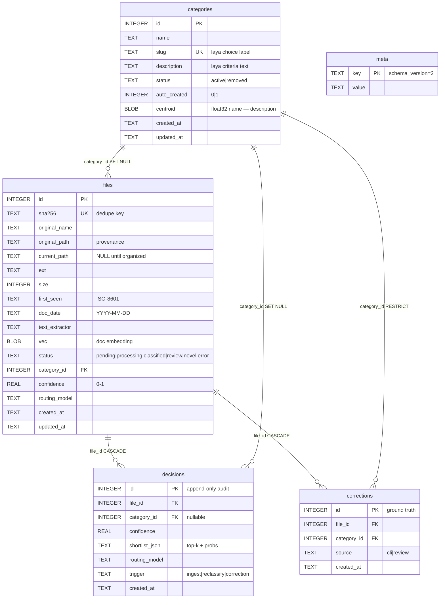
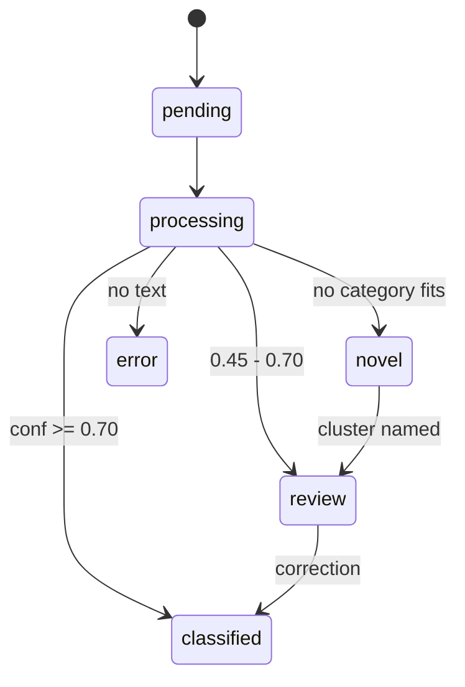

# 03 — Data Model

> Status: implemented in `src/embly/db.py` (schema v2). SQLite, `journal_mode=WAL`,
> `PRAGMA foreign_keys=ON`, single file at `.embly/embly.db`.
> Timestamps are ISO-8601 `TEXT` locally and map to `TIMESTAMPTZ DEFAULT now()` on Postgres;
> `BLOB` vectors map to `pgvector vector(dim)`; `INTEGER PRIMARY KEY` maps to
> `BIGINT GENERATED ALWAYS AS IDENTITY`.

## ERD





## Tables

See `src/embly/db.py` for the authoritative DDL. Shape (constraints abbreviated):

```sql
CREATE TABLE categories (
    id           INTEGER PRIMARY KEY,
    name         TEXT NOT NULL CHECK(length(name) > 0),
    slug         TEXT NOT NULL UNIQUE CHECK(length(slug) > 0),  -- laya choice label
    description  TEXT NOT NULL CHECK(length(description) > 0),  -- laya criteria text
    status       TEXT NOT NULL CHECK(status IN ('active','removed')),
    auto_created INTEGER NOT NULL DEFAULT 0 CHECK(auto_created IN (0,1)),
    centroid     BLOB,                      -- float32 embedding of "name — description"
    created_at   TEXT NOT NULL,
    updated_at   TEXT NOT NULL
);

CREATE TABLE files (
    id              INTEGER PRIMARY KEY,
    sha256          TEXT NOT NULL UNIQUE,   -- dedupe key, INSERT OR IGNORE closes the race
    original_name   TEXT NOT NULL CHECK(length(original_name) > 0),
    original_path   TEXT NOT NULL,          -- provenance
    current_path    TEXT,                   -- NULL until organized
    ext             TEXT,
    size            INTEGER CHECK(size IS NULL OR size >= 0),
    first_seen      TEXT NOT NULL,          -- ISO timestamp
    doc_date        TEXT CHECK(doc_date IS NULL OR date-shaped YYYY-MM-DD),
    text_extractor  TEXT,                   -- which extractor produced the text
    vec             BLOB,                   -- doc embedding for novelty/clustering
    status          TEXT NOT NULL CHECK(status IN
                      ('pending','processing','classified','review','novel','error')),
    category_id     INTEGER,                -- SET NULL when its category is removed
    confidence      REAL CHECK(confidence IS NULL OR (confidence BETWEEN 0 AND 1)),
    routing_model   TEXT,                   -- english|multilingual|typed-decisions
    created_at      TEXT NOT NULL,
    updated_at      TEXT NOT NULL,
    FOREIGN KEY(category_id) REFERENCES categories(id)
        ON DELETE SET NULL ON UPDATE CASCADE
);

CREATE TABLE decisions (                    -- append-only audit
    id             INTEGER PRIMARY KEY,
    file_id        INTEGER NOT NULL,        -- CASCADE: deleting a file drops its trail
    category_id    INTEGER,                 -- SET NULL: decision survives category removal
    confidence     REAL CHECK(confidence IS NULL OR (confidence BETWEEN 0 AND 1)),
    shortlist_json TEXT,                    -- top-k labels + probs
    routing_model  TEXT,
    trigger        TEXT NOT NULL CHECK(trigger IN ('ingest','reclassify','correction')),
    created_at     TEXT NOT NULL,
    FOREIGN KEY(file_id) REFERENCES files(id)
        ON DELETE CASCADE ON UPDATE CASCADE,
    FOREIGN KEY(category_id) REFERENCES categories(id)
        ON DELETE SET NULL ON UPDATE CASCADE
);

CREATE TABLE corrections (                  -- ground truth, feeds tune + fine-tune
    id          INTEGER PRIMARY KEY,
    file_id     INTEGER NOT NULL,           -- CASCADE with the file
    category_id INTEGER NOT NULL,           -- RESTRICT: keep ground truth while referenced
    source      TEXT NOT NULL CHECK(source IN ('cli','review')),
    created_at  TEXT NOT NULL,
    FOREIGN KEY(file_id) REFERENCES files(id)
        ON DELETE CASCADE ON UPDATE CASCADE,
    FOREIGN KEY(category_id) REFERENCES categories(id)
        ON DELETE RESTRICT ON UPDATE CASCADE
);

CREATE TABLE meta (
    key   TEXT PRIMARY KEY,                 -- 'schema_version' = 2
    value TEXT
);
```

## Indexes

```sql
-- files: review queue + category joins + doc-date lookups
CREATE INDEX idx_files_status ON files(status);
CREATE INDEX idx_files_category ON files(category_id);
CREATE INDEX idx_files_status_created ON files(status, created_at);
CREATE INDEX idx_files_doc_date ON files(doc_date);
-- categories: active-list + counts
CREATE INDEX idx_categories_status_slug ON categories(status, slug);
-- decisions: per-file audit trail + category/trigger scans
CREATE INDEX idx_decisions_file ON decisions(file_id);
CREATE INDEX idx_decisions_category ON decisions(category_id);
CREATE INDEX idx_decisions_created ON decisions(created_at);
CREATE INDEX idx_decisions_file_created ON decisions(file_id, created_at DESC);
-- corrections: ground-truth lookups
CREATE INDEX idx_corrections_file ON corrections(file_id);
CREATE INDEX idx_corrections_category ON corrections(category_id);
CREATE INDEX idx_corrections_created ON corrections(created_at);
```

Writes are atomic: ingest inserts `files` + `decisions` in one transaction with
`INSERT OR IGNORE` on `sha256`; category `remove`/`merge` wrap their two updates
in one transaction.

## Vectors

- **Doc vector** — mmBERT mean-pooled embedding of the file's cached text, stored as
  `files.vec BLOB` (float32). Used for the novelty check and for clustering pending-novel
  documents. Not needed after a file is assigned, but kept for re-clustering.
- **Category centroid** — `categories.centroid BLOB`, computed as
  `embed("<name> — <description>")`. Recomputed on **every** category edit (add, rename,
  describe, remove, merge), and the embed LRU cache is cleared at the same time.

Embeddings come from `laya.embed_fn_from_agent(agent)` (the multilingual checkpoint's
encoder), wrapped in `laya.cached_embed_fn` (LRU, 4096 entries).

## Status life cycle

```
pending ─▶ processing ─▶ classified         # filed, confident
                      ├─▶ review            # filed but flagged, or parked in unsorted/
                      ├─▶ novel             # awaiting cluster naming
                      └─▶ error             # no text extracted (unsupported/binary)
```

- `review` and `novel` are the two statuses surfaced by `embly review`.
- A correction moves a file to `classified` and writes a `corrections` row.
- Removing a category moves its files to `review` (parked in `unsorted/`), then triggers
  re-classification against the remaining set.

## Text cache

Extracted text lives at `.embly/texts/<sha256>.txt`, not in the DB. The DB stores only
the path (`text_extractor` records provenance). This keeps the database small and makes
re-classification a pure function of cached text + current categories.
